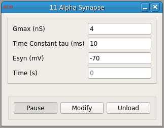

###Alpha Synapse

**Requirements:** None  
**Limitations:** None  

  

<!--start-->  

This module creates an artificial synapse where the fixed conductance change is described by an alpha function. The fixed conductance waveform is pre-computed according to:  

<!--end-->

<!--
G=Gmax\*(t/tau)\*exp(-(t-tau)/tau))
-->

 
The current is computed according to Ohm's Law:  

<!--
Isyn=G\*(Vm-Esyn)
-->

 
This conductance is triggered by an event indicated by a value of “1″ on input(1). This can be used to generate a spike-triggered synaptic connection using the [Spike Detector module](https://github.com/RTXI/spike-detector). Use the connector module to connect the spike state output of the spike detector to the sp
ike state input of this one.  

####Input Channels
1. input(0) – “Vm” : Membrane potential (V)
2. input(1) – “Spike State” : Spike State (=1 to trigger synapse)

####Output Channels
1. output(0) – “Isyn” : Output current (A)

####Parameters
1. Gmax : Maximum synaptic conductance for stimulus (nS) 
2. Time Constant tau : Time constant for alpha-shaped conductance (ms) 
3. Esyn : Reversal potential for conductance (mV) 
